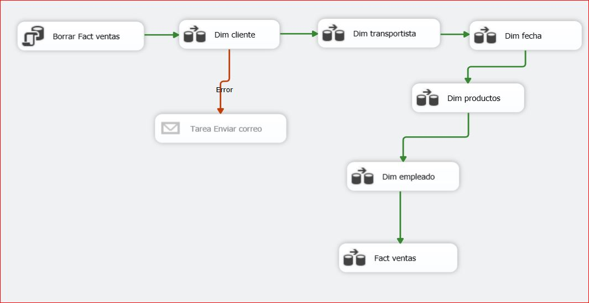

# Proyecto de ETL para Inteligencia de Negocios

Este proyecto tiene como objetivo realizar procesos ETL (Extracción, Transformación y Carga) para la creación de un cubo OLAP, generación de KPIs y visualización de datos en Power BI. Se utilizan herramientas como SQL Server Integration Services (SSIS) para la manipulación de datos, SQL Server Analysis Services (SSAS) para la construcción del cubo, y Power BI para el análisis y presentación visual.

## Contenido
- [Requisitos](#requisitos)
- [Estructura del Proyecto](#estructura-del-proyecto)
- [Instrucciones de Ejecución](#instrucciones-de-ejecución)

---

## Requisitos

Para ejecutar este proyecto, necesitas contar con las siguientes herramientas instaladas:

- **SQL Server Integration Services (SSIS)**: Para el proceso ETL.
- **SQL Server Management Studio (SSMS)**: Para administrar SQL Server.
- **SQL Server Analysis Services (SSAS)**: Para desarrollar el cubo OLAP y los KPIs.
- **Power BI**: Para la visualización y análisis de datos.

Asegúrate de tener un entorno configurado con SQL Server y permisos para ejecutar proyectos de SSIS y SSAS.

## Estructura del Proyecto

El proyecto está organizado de la siguiente manera:

- **files/**
  Contiene archivos de datos y configuraciones utilizadas en el proyecto:
  - `CuboKentFoodVisualStudio.rar`
  - `Echeverria_catril_ojeda_006D.rar`

- **images/**
  Contiene imágenes relacionadas con el proyecto:
  - `borrafact.png`
  - `cubokent.JPG`
  - `ETL.JPG`
  - `ETLfactventnntas.JPG`
  - `ETLincrementalcliente.JPG`
  - `factpoblada.png`
  - `kentdw.JPG`
  - `kentorigen.JPG`
  - `kpiejemplo.JPG`

- **informe final/**
  Contiene el informe final del proyecto:
  - `Informe Inteligencia de Negocios.pdf`

- **kpis/**
  Archivos de datos y KPIs generados:
  - `KPI.xlsx`

## Instrucciones de Ejecución

### Proceso ETL
Utiliza SSIS para implementar los paquetes ETL que extraen, transforman y cargan los datos en la base de datos.

1. Abre SQL Server Data Tools (SSDT).
2. Carga el proyecto `CuboKentFoodVisualStudio.rar`.
3. Configura las conexiones a las bases de datos de origen y destino.
4. Ejecuta los paquetes ETL para cargar los datos transformados en la base de datos de destino.

### Desarrollo del Cubo OLAP
Utiliza SSAS para crear el cubo OLAP.

1. Abre SQL Server Data Tools (SSDT).
2. Carga el archivo de proyecto SSAS correspondiente.
3. Configura las dimensiones, hechos y medidas del cubo.
4. Procesa y despliega el cubo en SQL Server Analysis Services.

### Generación de KPIs
1. Abre el archivo `KPI.xlsx` para revisar las métricas generadas.
2. Configura los KPIs dentro del cubo utilizando SSAS.

### Visualización en Power BI
1. Conecta Power BI al cubo OLAP desarrollado en SSAS.
2. Crea visualizaciones e informes basados en los datos disponibles.
3. Publica los informes en el servicio de Power BI si es necesario.

---
